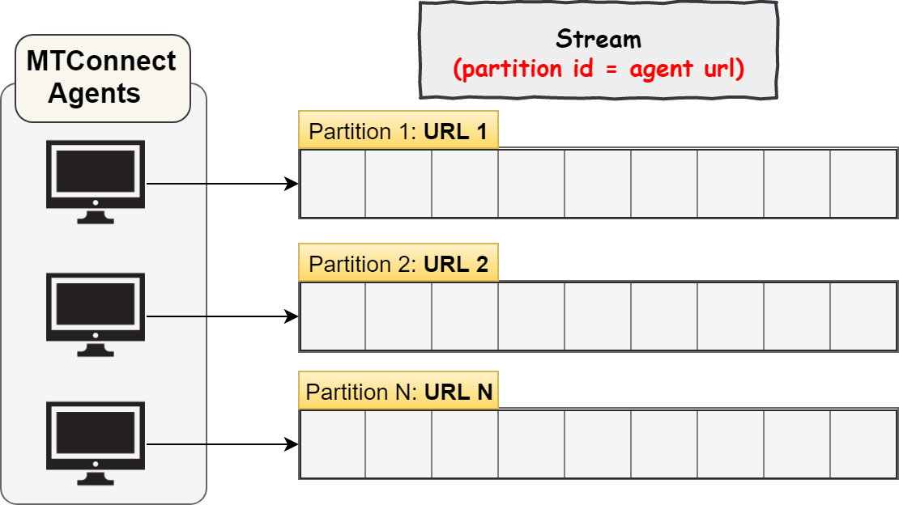
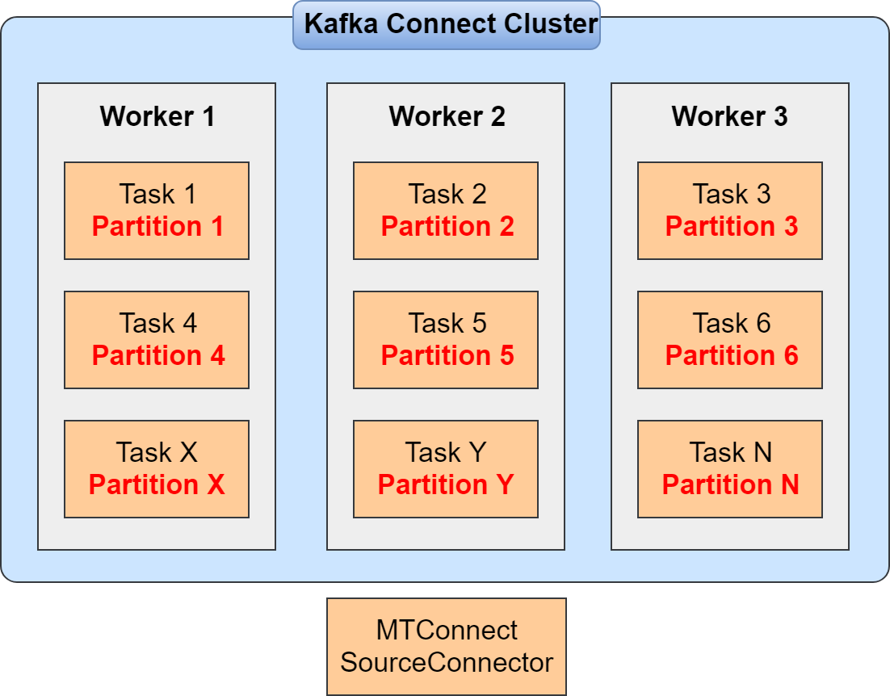
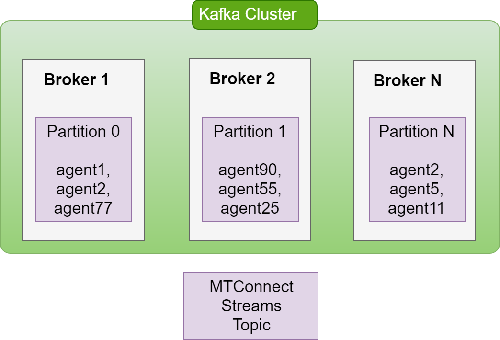

# Kafka Connect Source Connector For MTConnect 
`kafka-connect-mtconnect-source` is used to collect data from MTConnect agents to Apache Kafka. 

## Contents 
- [Building the Connector](#building-the-connector)    
- [MTConnect Protocol](#mtconnect-protocol)    
- [Advantage Of MTConnect Connector](#advantage-of-mtconnect-connector)    
- [MTConnect Connector Design](#mtconnect-connector-design)    
- [Minimize The Data Loss](#minimize-the-data-loss)    
- [Source Properties](#source-properties)
    
## Building the Connector 
- Maven 3.1 or later    
- Java 8 or later    
- Git (optional)    
    
Clone repository using the following command (or directly download project):     
```shell 
git clone https://github.com/mangrrua/kafka-connect-mtconnect-source.git 
```    
 Go to the project directory:    
```shell 
cd kafka-connect-mtconnect-source
```    
 Build project:     
```shell
mvn clean package
```    
 Jar with dependencies will be created in the `/target` directory as `project-name-1.0-jar-with-dependencies.jar`.    
    
## MTConnect Protocol 
MTConnect standard provides two way to get streaming data from the agents. One of them is `"use nextSequence"` every time. In this way, we must create a new `URL` with `nextSequence` that received from the previous response. Then, we create a new connection with the Agent. This way is working but not optimized. Ìn this way, `"nextSequence"` must be controlled by client. Also, new connection, created between client and agent, is very costly for each request. Shortly, we pull data from the Agent with a specified interval in this way.     
    
The other way gets only changed data from MTConnect Agent. In this way, `multipart/x-mixed-replaced` connection is established between client and agent. Once the connection is established, **the agent sends data to the client as a chunk with a specified interval time**. The connection between client and agent is always open until the client or agent downs or fails.   
    
Data that sent from agent looks like this;     
    
```xml
HTTP Connection "Content-Type": multipart/x-mixed-replace;boundary=anything    

--anything 
Content-type: text/xml 
Content-length: xxxxx    

<?xml version="1.0" encoding="UTF-8"?> 
<MTConnectStreams xmlns:m="urn:mtconnect.org:MTConnectStreams:1.4" xmlns="urn:mtconnect.org:MTConnectStreams:1.4" xmlns:xsi="http://www.w3.org/2001/XMLSchema-instance" xmlns:x="urn:mazakusa.com:MazakStreams:1.4"xsi:schemaLocation="urn:mazakusa.com:MazakStreams:1.4 /schemas/MazakStreams_1.4.xsd">
	<Header creationTime="2019-08-16T21:31:54Z" sender="DMZ-MTCNCT" instanceId="1564950676" version="1.4.0.12" bufferSize="131072" nextSequence="479248" firstSequence="479245" lastSequence="610316"/>
	<Streams>
		<DeviceStream name="Mazak" uuid="M80104K162N">
			<ComponentStream component="Linear" name="Y" componentId="y">
				<Samples>
					<Load dataItemId="Yload" timestamp="2019-08-14T13:11:26.733527Z" sequence="479245">37</Load>
				</Samples>
			</ComponentStream>
			<ComponentStream component="Linear" name="Z" componentId="z">
				<Samples>
					<AxisFeedrate dataItemId="Zfrt" timestamp="2019-08-14T13:11:26.733527Z" sequence="479247">21.91904</AxisFeedrate>
					<Load dataItemId="Zload" timestamp="2019-08-14T13:11:26.733527Z" sequence="479246">3</Load>
				</Samples>
			</ComponentStream>
		</DeviceStream>
	</Streams>
</MTConnectStreams>


 --anything
 Content-type: text/xml
 Content-length: xxxxx    
 
 ....    

 --anything-- // end of the stream
```
     
 Each data between `boundary-to-boundary(--anything to --anything for this example`) is called as the `chunk`. Client just needs to read the chunk from the connection. Client does not need to track `nextSequence` for each time. The agent tracks `nextSequence` for each client, and it sends only `new data` to client with a specified interval if data exist. This is better way to get streaming data from the MTConnect agents. It also improves network loads. Shortly, in this way, we say **"Agent, send me new data if exist"**.    
    
In the second way(changed data only), we should configure some properties. These properties are;    
1. **Interval**:  Send data every specified time if there is new data in the buffer. Must be millisecond.    
2. **Count**: Maximum number of data to be sent each time.    
3. **Heartbeat**: If there is no data available in the buffer, the agent must send out a heartbeat to maintain contact with client every specified time. Must be millisecond. Heartbeat is basically empty MTConnect Streams document. Thus, we will ignore empty document.     
    
Example URL to get streaming data using the above way;    
`http://agent:5901/sample?interval=1000&count=100&heartbeat=10000`    

 For more details, you can look to [MTConnect Protocol](http://mtcup.org/wiki/Protocol)    
    
**In the Kafka Connect MTConnect Source, second(changed data only) way was used.**    

 ## Advantage Of MTConnect Connector 
 MTConnect is a global standard for manufacturing environments. It is used especially for CNC machines. There is a lot of ways to collect MTConnect data depend on data throughput, frequency, etc. For example, we can set up extra service that worked on the panel PC for each CNC machine. It receives data from the agent and sends it to anywhere what you want. But, we generally want to minimize data loss and speed up the data collection.   
    
`Firstly, you should define your requirements and your system flow`. The reason that you will analyze and visualize the collected data. We are talking about data produced by CNC machines they can produce thousands of data per second. At this point, welcome to the big data world!     
    
- **We don't want to data loss(or minimize it)!** -
- **We want to analyze collected data!** - 
- **We want to minimize the cost!** - 
- **We want to save time!**    

 A lot of technologies exist in the big data world. One of the most commonly used technology is, `Apache Kafka`. It's a very powerful, high-speed queue between systems. If your data rate is so high, you can use Kafka to ingest data. Then, you can get data from Kafka with streaming or batch processing engine.     
    
#### So, what is the advantage of this connector?    
 Assume that you have extra service that working on panel PC of CNC machine. Each service sends data to the centralized system. That's working now. But, it is difficult to maintain and manage. If any error occurs in any panel pc(even if other than agent errors), you must intervene to related panel pc to re-collect the data from the agent. This is important that panel PCs generally fail or down. We may lose a lot of data because of this. We don't want this!    
    
With Kafka Connect MTConnect Source Connector, we collect data from agents into a `centralized system`. We don’t use any extra system or service between agent and centralized system. We collect data directly into a centralized sytem. In this system, we don’t pull data from the agents, agents sends data to the centralized system every specified time. Client that working on the centralized system just read the response of the agent. No external services. No external maintenance. No external errors. We can send it to the anywhere from the Kafka! So, this is so important!    
    
For this, you just need to set up a Kafka Connect Cluster. This is more manageable, more fault-tolerant and less maintenance. Also, if any node in the cluster is down, Kafka Connect automatically assigns tasks to other nodes. This minimizes the duration to get data again, and data loss while collecting data. Kafka connect collects data from the agents, then sends it to Kafka topic to transmission to streaming engines etc.         
    

## MTConnect Connector Design 
Connector assumes that each agent URL is a `source partition`(look partition system for Kafka connect [Kafka Connect Details](https://docs.confluent.io/current/connect/devguide.html)). Look below image to learn how MTConnect connector designed for source partitions.     
    
    
    
`MTConnect Source Connector` assigns each partition to one `source task(SourceTasks are given a dedicated thread)`. Like this;    
    
    
    
`Each source task will get data from the assigned agent`. **Only one agent assigned to the one source task**. We could assign more than one partition to each source task. But, if one task fails due to anything, data will not receive from the assigned agents. We don’t want this. We want to minimize data loss. We always want to get data.     
    
Each task in the connector firstly opens a connection with the assigned agent. Then, it reads data from the connection(waits for the data if not exist in the connection), then sends it to specified Kafka topic as `String XML format`. If received response from the agent is empty(received heartbeat from the agent), connector ignores it.     
  
### MTConnect Data Record Format For Kafka  
Each received response is saved as String XML format in the Kafka. But, `data must be ordered!`MTConnect data is by nature time-series data. Thus, we must get and analyze data in order. Kafka may have `multiple partitions` for a topic.  Kafka ensures the data is ordered inside a partition, but **it does not guarantee the data in order across all partitions!** So, how can we do this?   
  
_Solution; send related data to the same partition!_ Connector sends the data received from the same agent to the same partition of the Kafka topic. Like this(image just simulates the partitions for agent urls);  
  
  
  
As you can see from the above image, `each data received from the same agent is sent to the same partition.` Thus, each received data is ordered in the Kafka partitions! You can safely get data from the Kafka, and ensure that data is ordered!

To achieve the above result, the connector creates `a source record key using agent_url`. So, MTConnect record structure looks like this;

```shell
recordKey: agent_url (StringSchema)
recordValue: MTConnectResponse (String Schema)
```

You can get data as String XML format. But if you want to convert XML to JSON, you can write a custom `Kafka Connect Single Message Transform` for this. 
 
    
### So, what happens to "unreachable agents" ? 
Generally, agents fail, dows or operator shutdown it. Thus, we can’t reach the agent. In this case, we may want to know `which` and `why` agents unreachable now.     
    
Connector tries to establish the connection with the agent. If the connection fails, it sends the unreachable agent to another Kafka topic with the error message. For example; `http://agent1:5199` is unreachable now. Agent sends it to Kafka topic as JSON String format like this;    
    
```shell 
{    
	"agent_url": "http://agent1:5199", 
	"error_message": "connect timeout", 
	"request_timestamp": "1565981488000"
}
```

 You can get unreachable agent information from the specified Kafka topic, and decide which and why agents are unreachable now. Also, you can analyze the historical data using the `error_messages`, then find which errors generally occur when agents unreachable.      
    
 ## Minimize The Data Loss 
 MTConnect Connector offers two options from based on where you want to get the data. 
 1. You always get the latest data. If you'll choose that, data will be received from the ending of the agent buffer when any connector or task fails occurs. The connector will not use the saved offsets for this option. In this option, **you may lose a lot of data**. 
 
 2. Kafka Connect provides to store `source partition` offsets in the Kafka topics. The connector can use the latest offsets(as called `source offsets`) to get data from where it left off. Connector uses `instanceId` and `nextSequence` as offsets. 

	```shell
	- Source Partitions - 
		agent_url: URL
	 
	- Source offsets - 
		instance_id: xxxx
		next_sequence: yyyy
	```

	If you'll choose this option, connector assumes that you want to minimize the data loss. It gets offsets from the Kafka topic to use offsets. Also, it gets the current buffer state of the agent using the `current request`. For example, the latest offsets like this;    
    
	```shell    
	- Saved Offsets in the Kafka Topic -
		 instanceId: 15, 
		 nextSequence: 100
	```  

	and `nextSequence, firstSequence and instanceId` of the Current Request  like this;    
	```shell    
	 <Header firstSequence=50 instanceId=15 nextSequence=100 ... />
	```  

	If any offsets not found, the connector will get data from the beginning of the agent buffer. If found, connector checks the `instanceIds`. `InstanceId` will be changed if the agent restart. Therefore, connector wants to make sure instanceIds is the same. If instanceIds are different, it `will get data from the beginning of the agent buffer`. 

	**_Note:_** _We can not anything to the removed data from the agent buffer!_
	
	 If `instanceIds` are the same(like the above example), then it checks the `nextSequence` exist or not in the agent buffer. If `firstSequence` is less than the `nextSequence`, that means the agent still has the data.  It will receive data using saved `nextSequence` in the offsets. If not exist in the agent buffer, it will get data from the beginning of the agent buffer. 

	So, assume that we have `nextSequence=100` in the offsets, and `firstSequence=99` in the current buffer state. In this case, the connector will receive data that have nextSequence is greater than the `100`. But, agent buffer maybe removes a lot of data until `source task` receives data(that means new `firstSequence` is greater than the `nextSequence`). You don't need to worry! 

	If `source task` successfully connected to the agent, it first checks the connection is `multipart/x-mixed-replace` or not. If it's `multipart/x-mixed-replace`, the source task will start to receive data. If not, this may have happened for two reasons. One is MTConnect Agent could have sent an error response for this request. Therefore, source task checks the response to contains `MTConnectError` tag or not. If contains, task will get start the data from the beginning of the agent buffer. If it does not contain, that means agent did not support multipart/x-mixed-replace. 

## Source Properties

`property`: unreachable.agents.topic

`Description`: If not successfully connected to the agent or connection fails while getting data, AGENT_URL will be sent to the specified Kafka topic with the error message and request timestamp.

`Type`: String

`Default Value`: unreachable-mtconnect-agents

<hr>

`property`: always.from.latest

`Description`: If this property is true, each time you connect to the MTConnect agent, data will be received from the ending of the MTConnect agent buffer. If you want to minimize the data loss, set this property to false. If it's false, task firstly will try to use saved offsets. If any offsets not found, it'll receive data from the beginning of the buffer. If there is found any offsets, it checks the current buffer status of the agent. If the agent did not restarted, it'll check whether data with saved offsets already exist in the buffer. If data exist, it'll try to get data using saved offsets. If not, it'll be getting data from the beginning of the buffer.

`Type`: Boolean

`Default Value`: true

<hr>

`property`: agent.urls

`Description`: Agent URLs with comma-separated list. **Note that, this property will be removed in the later versions. Agents URLs will be received from the external system, and the connector will detect URLs at runtime.**

`Type`: List

`Default Value`: null

<hr>

`property`: mtconnect.interval.ms

`Description`: Send data every specified time if there is new data in the buffer. Must be millisecond.

`Type`: Integer

`Default Value`: 1000

<hr>

`property`: mtconnect.count

`Description`: Maximum number of data to be sent each time.

`Type`: Integer

`Default Value`: 100

<hr>

`property`: mtconnect.heartbeat.ms

`Description`: Interval to prevent connection fails between client and MTConnect Agent. If there is no data available in the buffer, the agent must send out a heartbeat to maintain contact.

`Type`: Integer

`Default Value`: 5000

<hr>

`property`: http.connect.timeout.ms

`Description`: Maximum time to connect to the MTConnect Agent.

`Type`: Integer

`Default Value`: 15000

<hr>

`property`: http.read.timeout.ms

`Description`: Maximum time to read data from the MTConnect Agent. Value of this property must be greater than the 'heartbeat' value. If not, the connection will be closed each time if there is no available new data in the agent.

`Type`: Integer

`Default Value`: 15000
